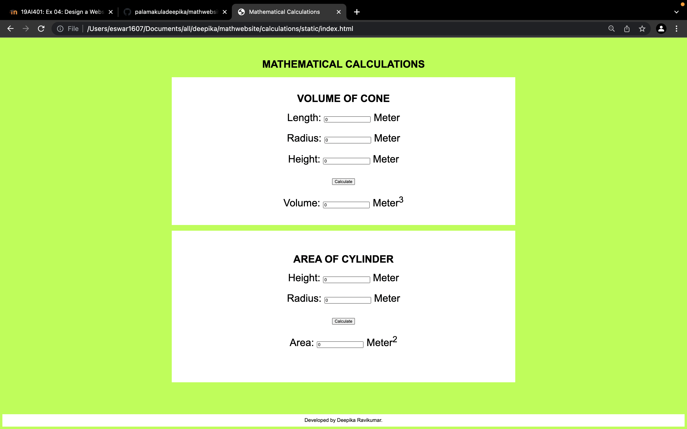

# Web Page for Mathematical Calculations

## AIM:

To design a static website with validation to perform mathematical calculations in client side.

## DESIGN STEPS:

### Step 1:

Requirement collection.

### Step 2:

Creating the layout using HTML and CSS.

### Step 3:

Write javascript to perform the calculations.

### Step 4:

Include regularexpression based input validation.

### Step 5:

Validate the layout in various browsers.

### Step 6:

Validate the HTML code.

### Step 6:

Publish the website in the given URL.

## PROGRAM :

### Index.html:
~~~
<!DOCTYPE html>
<html lang="en">
<head>
    <meta charset="UTF-8">
    <meta http-equiv="X-UA-Compatible" content="IE=edge">
    <meta name="viewport" content="width=device-width, initial-scale=1.0">
    <title>Mathematical Calculations</title>
    <link rel="stylesheet" href="./css/layout.css" />
</head>
<body>
  <h1>MATHEMATICAL CALCULATIONS</h1>
    

        

            <h1 class="text">VOLUME OF CONE</h1>
            <form>
                
<label for="lenEdit">Length:</label>
                    <input type="text" id="lenEdit" value="0"/>
                    <lable for="lenEdit">Meter</lable>
                

                 
                

                    <label for="bEdit">Radius:</label>
                    <input type="text" id="bEdit" value="0"/>
                    <lable for="bEdit">Meter</lable>
                

                 
                
<label for="hEdit">Height:</label>
                  <input type="text" id="hEdit" value="0"/>
                  <lable for="hEdit">Meter</lable>
              

               
                

                    <input type="button" value="Calculate" id="areaButton"/>
                

                 
                

                    <label for="areaEdit">Volume:</label>
                    <input type="text" id="vEdit" value="0" readonly />
                    <label for="areaEdit">Meter3</label>
                

                  
                
 
                

                

                    

                        <h1>AREA OF CYLINDER</h1>
                        <form>
                            

                                <lable for="aedit">Height:</lable>
                                <input type="text" id="aedit" value="0"/>
                                <lable for="aedit">Meter</lable>
                            
 
                            

                                <lable for="bedit">Radius:</lable>
                                <input type="text" id="bedit" value="0"/>
                                <lable for="bedit">Meter</lable>
                            
 
                            

                                <input type="button" value="Calculate" id="addbutton"/>
                            
 
                            

                                <lable for="vedit">Area:</lable>
                                <input type="text" id="vedit" value="0" readonly="0"/>
                                <lable for="vedit">Meter2</lable>
                            

                            
                        </form>
                    

                

            </form>
        

    

        

    

    
    

      Developed by Deepika Ravikumar.
    

</body>
</html>
~~~

### CSS:
~~~
* {
    box-sizing: border-box;
    font-family: Arial, Helvetica, sans-serif;
  }
  body {
    background-color: greenyellow;
  }
  .container {
    width: 1080px;
    padding-bottom: 100px;
    margin-left: auto;
    margin-right: auto;
  }
  .content {
    display: block;
    width: 100%;
    background-color: white;
    min-height: 300px;
    margin-top: 10px;
  }
  h1{
      text-align: center;
      padding-top: 50px;
      color: black;
  }
  .formelement{
      text-align: center;
      font-size:xx-large;
      margin-top: 5px;
      margin-bottom: 5px;
  }
    
    .footer {
        display: block;
        width: 100%;
        height: 40px;
        background-color: white;
        text-align: center;
        padding-top: 10px;
        margin: 0px 0px 0px 0px;
        color: black;
    }
~~~

## OUTPUT:

## Result:

Thus a website is designed to perform mathematical calculations in the client side.
